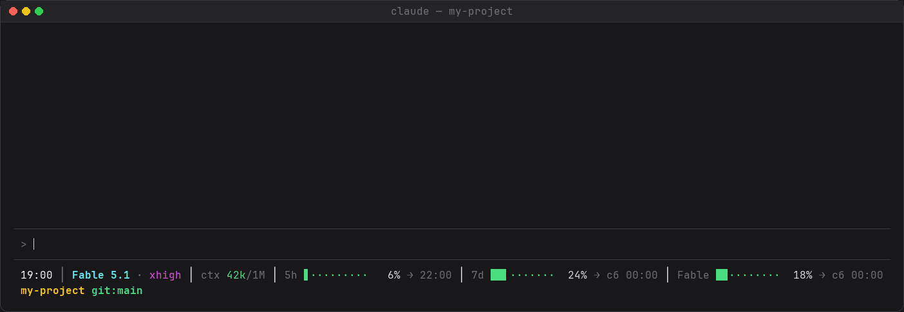

# claude-code-statusline

Статусбар для [Claude Code](https://claude.ai/code) в две строки: часы, модель,
уровень усилий (effort), занятый контекст, расход лимитов за 5 часов и 7 дней
и отдельные недельные лимиты моделей (например, Fable) с временем обнуления.



```
19:00 │ Fable 5.1 · xhigh │ ctx 69k/1M │ 5h ▌·········   5% → 22:00 │ 7d ██▌·······  25% → ср 00:00 │ Fable █▎········  12% → ср 00:00
my-project git:main*
```

Вторая строка — имя текущей папки и ветка git; звёздочка означает, что в рабочем
дереве есть несохранённые правки.

## Установка

```sh
curl -o ~/.claude/statusline.sh https://raw.githubusercontent.com/Daloshka/claude-code-statusline/main/statusline.sh
chmod +x ~/.claude/statusline.sh
```

Дальше в `~/.claude/settings.json` добавьте блок (путь — абсолютный, без тильды):

```json
{
  "statusLine": {
    "type": "command",
    "command": "/Users/ВАШЕ_ИМЯ/.claude/statusline.sh"
  }
}
```

Статусбар подхватится сам, перезапускать Claude Code не нужно.

Из зависимостей нужны только `bash`, `jq` и `curl`. Если `jq` не установлен, скрипт
вместо статусбара напишет об этом одной строкой, а не сломается молча. Без `curl`
работает всё, кроме лимитов моделей и автообновления.

## Автообновление

Раз в сутки скрипт в фоне сверяет себя с этим репозиторием и, если версия на
GitHub отличается, заменяет себя на неё. Так что после установки ничего руками
обновлять не нужно: выложил новую версию — у всех подтянулась в течение суток.

Как это устроено:

- новая версия скачивается во временный файл и подменяет скрипт атомарно
  (через `mv`), уже запущенный экземпляр не пострадает;
- перед подменой файл проверяется: начинается с `#!` и проходит `bash -n`,
  иначе (например, вместо скрипта прилетела страница 404) ничего не меняется;
- предыдущая версия остаётся рядом как `statusline.sh.bak`;
- проверка идёт только если файл доступен на запись.

Отключить: `SELF_UPDATE=0`. Проверять чаще или реже: `SELF_UPDATE_TTL` в секундах.

**Важно:** из-за автообновления правки прямо в `statusline.sh` будут затёрты
при следующем обновлении. Свои настройки кладите в `~/.claude/statusline.env`,
этот файл скрипт подключает при каждом запуске и никогда не трогает:

```sh
# ~/.claude/statusline.env
BAR_WIDTH=15
MODEL_LIMITS_TTL=600
```

## Лимиты отдельных моделей (Fable)

У подписок с Fable есть отдельное недельное окно, но Claude Code в JSON
статусбара передаёт только `5h` и `7d`. Поэтому модельные лимиты скрипт берёт
сам из того же usage API, который показывает `/usage`:

- OAuth-токен берётся из Keychain (macOS, запись `Claude Code-credentials`)
  или из `~/.claude/.credentials.json` (Linux). На macOS при первом обращении
  система может спросить, разрешить ли доступ к Keychain, нажмите
  «Always Allow», иначе диалог будет всплывать при каждом обновлении;
- ответ кешируется в `~/.claude/cache/statusline-usage.json` и обновляется в
  фоне раз в `MODEL_LIMITS_TTL` секунд (по умолчанию 300): чаще нельзя, API
  отвечает 429, и тогда скрипт ждёт столько, сколько попросит `Retry-After`;
- показываются все окна с привязкой к модели, ярлык берётся из ответа API.
  Если такого окна у подписки нет, блок не рисуется;
- статусбар из-за этого не тормозит: сеть только в фоне, на экран идёт кеш.

Отключить: `MODEL_LIMITS=0`.

## Несколько консолей одновременно

Все открытые консоли Claude Code показывают одни и те же цифры и не
заваливают API параллельными запросами:

- usage API опрашивает только одна консоль за раз: замок ставится атомарно
  (`mkdir`), а если опрос прервали и замок старше 60 секунд, он снимается сам,
  статусбар не «замерзает»;
- Claude Code даёт каждой консоли `5h`/`7d` только из её собственного последнего
  ответа, поэтому простаивающая консоль видела бы старые проценты. Скрипт
  сливает всё в общий файл `~/.claude/cache/statusline-limits.json`: внутри
  одного окна берётся максимум (расход в окне только растёт), окно с более
  поздним сбросом вытесняет старое, а истёкшее окно показывается как 0%.

## Платформы

Скрипт сам определяет систему и подстраивается — ставится везде одинаково,
править ничего не надо.

| Система | Что учитывается |
|---|---|
| macOS | `date` от BSD: время сброса лимитов считается через `date -r ts` |
| Linux, WSL | `date` от GNU: через `date -d @ts`. Alpine с BusyBox тоже работает |
| Windows: Git Bash, MSYS2, Cygwin | пути вида `C:\Users\...` приводятся к прямым слешам, иначе имя папки во второй строке определялось бы неверно. Кодовая страница проверяется через `chcp`: в Windows Terminal локали часто нет, но UTF-8 включён |

Если терминал **не** в UTF-8, псевдографика автоматически заменяется на ASCII,
а дни недели — на латинские, чтобы вместо статусбара не было мусора из вопросов:

```
19:00 | Opus 5 - xhigh | ctx 69k/1M | 5h #......... 5% -> 22:00 | 7d ###....... 25% -> Wed 00:00
```

## Настройки

Задаются переменными окружения или в файле `~/.claude/statusline.env`.

| Переменная | Значения | Что делает |
|---|---|---|
| `BAR_STYLE` | `auto` (по умолчанию) | Псевдографика, если терминал в UTF-8, иначе ASCII |
| | `subcell` | Бар с точностью до 1/8 клетки: `██▌·······` |
| | `block` | Простые квадратики: `▓▓▓░░░░░░░` |
| | `ascii` | Только ASCII: `###.......` |
| `BAR_WIDTH` | число, по умолчанию `10` | Ширина бара в символах |
| `WEEKDAYS` | по умолчанию `пн вт ср чт пт сб вс` | Сокращения дней недели, начиная с понедельника |
| `MODEL_LIMITS` | `1` (по умолчанию) или `0` | Показывать недельные лимиты отдельных моделей (Fable) |
| `MODEL_LIMITS_TTL` | секунды, по умолчанию `300` | Как часто переспрашивать usage API |
| `SELF_UPDATE` | `1` (по умолчанию) или `0` | Подтягивать свежую версию скрипта с GitHub |
| `SELF_UPDATE_TTL` | секунды, по умолчанию `86400` | Как часто проверять обновление |

Задавать лучше в `~/.claude/statusline.env`, а не в самом скрипте: см. раздел
«Автообновление».

Цвет бара зависит от заполнения: до 50 % зелёный, до 80 % жёлтый, дальше красный.
По тем же зонам красится и число занятых токенов контекста.
Уровень effort тоже красится: `low` зелёный, `medium` голубой, `high` жёлтый,
`xhigh` пурпурный, `max` красный.

## Как проверить, что работает

Скрипт читает JSON статусбара со стандартного ввода, так что его можно прогнать руками:

```sh
echo '{
  "model": {"display_name": "Opus 5 (1M context)"},
  "effort": {"level": "xhigh"},
  "context_window": {
    "total_input_tokens": 69203,
    "context_window_size": 1000000,
    "used_percentage": 7
  },
  "cwd": "'"$PWD"'",
  "workspace": {"current_dir": "'"$PWD"'"},
  "rate_limits": {
    "five_hour": {"used_percentage": 5,  "resets_at": 1788444000},
    "seven_day": {"used_percentage": 25, "resets_at": 1788883200}
  }
}' | ~/.claude/statusline.sh
```

Чтобы посмотреть ASCII-режим, добавьте перед вызовом `LC_ALL=C`.

## Особенности

- Уровень effort берётся из поля `effort.level` во входном JSON. На старых версиях
  Claude Code этого поля нет — тогда бейдж просто не рисуется, остальное работает.
- Скобка из имени модели срезается: `Opus 5 (1M context)` показывается как `Opus 5`,
  а размер окна виден в знаменателе блока `ctx`.
- Блок `ctx` показывает занятые токены и размер окна из `context_window`. Занято —
  это `total_input_tokens`, то есть входные токены вместе с кэшем; процент для
  расцветки берётся из `used_percentage`, чтобы число и цвет не расходились.
  На версиях Claude Code без `context_window` блок не рисуется, а размер окна
  в этом случае определяется по суффиксу `(1M context)` в имени модели.
- Блок лимита не рисуется, если его нет во входном JSON, так что подписки без
  недельного лимита показывают только `5h`.
- Лимиты моделей запрашиваются, только если во входном JSON есть `seven_day`:
  на API-ключе или через Bedrock/Vertex подписочных лимитов нет и лезть в API
  незачем.
